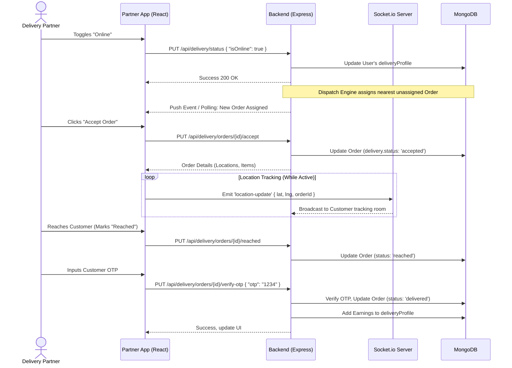

# Partner Frontend (Delivery Partner) Architecture & Documentation

This document outlines the architecture, data flow, component design, and API interactions for the `partnerFrontend`, which is dedicated to RapidCloth Delivery Partners. It also covers the corresponding backend services required to power these features.

---

## 1. Frontend Architecture (React + Vite)

The Partner Frontend is a standalone Single Page Application (SPA) designed to be highly responsive (mobile-first), as delivery partners use it on the go.

### Key Pages & Components (`src/pages/delivery/`)
- **DeliveryDashboard:** Central hub showing current online status, active order overlay, and quick stats.
- **DeliveryOrders:** View assigned orders, pickup locations, customer locations, and map integrations.
- **DeliveryEarnings:** Weekly/Monthly earning breakdowns, COD (Cash on Delivery) remittance UI to pay the company.
- **DeliveryShifts:** Allows partners to pre-book working slots to guarantee higher base pay.
- **DeliveryHistory:** Past delivered/returned orders log.
- **DeliverySupport & Emergency:** Ticket creation for issues on the field, and SOS/Emergency buttons.

### State Management & Utilities
- Uses React Context / local state for immediate UI changes.
- `axios` instance configured in `src/api/index.js` automatically attaches the Partner's JWT token to every request and handles 401 redirects globally.

---

## 2. Data Flow & Interaction Diagram

The following sequence diagram illustrates the lifecycle of a delivery partner's active shift, from toggling online to delivering an order.



---

## 3. Backend Architecture & Component Design (Delivery Module)

To support the Partner Frontend, the backend implements a specific suite of models, controllers, and socket events.

### 3.1 Backend Components

1. **Delivery Controller (`src/controllers/delivery.controller.js`)**
   - **Order Dispatcher:** An algorithm (often running via a cron job or triggered on order placement) that queries MongoDB for `Users` with `role: "delivery"` and `deliveryProfile.isOnline: true`, sorted by distance to the `sellerHubLocation` or `pickupLocation` using `$near` or `$geoNear` aggregation.
   - **Earnings Calculator:** Calculates delivery payout based on distance (`deliveryDistanceKm`) and flat rates, and increments `user.deliveryProfile.totalEarnings`.
   
2. **Models (`User` and `Order`)**
   - **User Model:** Contains a `deliveryProfile` subdocument managing `isOnline`, `currentOrderId`, `cashCollected`, `totalEarnings`, `vehicleType`, and `remittanceHistory`.
   - **Order Model:** Contains a `delivery` subdocument storing `deliveryBoyId`, `status` (unassigned, assigned, accepted, rejected), `rejectedBy` array (to avoid re-assigning to the same driver), and `deliveryOTP`.

3. **Socket Server (`src/index.js` -> `socket.io`)**
   - Authenticated sockets that listen for `location-update` events from the partner app.
   - Broadcasts these updates to specific rooms named after the `orderId` so only the customer expecting the delivery sees the live map.

---

## 4. API Endpoints & Payloads

Below is the detailed breakdown of the API endpoints consumed by `partnerFrontend/src/api/index.js`.

### Status & Profile Management
- **PUT `/api/delivery/status`**
  - **Action:** Toggle duty status.
  - **Payload:** `{ "isOnline": true }`
  - **Response:** `{ "message": "Status updated", "isOnline": true }`

- **GET `/api/delivery/profile`**
  - **Action:** Fetch current delivery metrics and info.
  - **Response:** 
    ```json
    {
      "name": "Partner Name",
      "deliveryProfile": {
         "isOnline": true,
         "cashCollected": 1500,
         "totalEarnings": 4200,
         "vehicleType": "Bike"
      }
    }
    ```

### Order Workflow
- **GET `/api/delivery/orders/current`**
  - **Action:** Retrieve the currently assigned or ongoing order.
  - **Response:** `{ "order": { "_id": "...", "deliveryLocation": {...}, "status": "assigned" } }`

- **PUT `/api/delivery/orders/:id/accept`**
  - **Action:** Partner accepts the assigned order.
  - **Payload:** None (Header Auth used to identify partner).
  - **Response:** `{ "message": "Order accepted", "status": "picking" }`

- **PUT `/api/delivery/orders/:id/reject`**
  - **Action:** Partner rejects the order, causing the backend to re-assign it.
  - **Payload:** None.
  - **Response:** `{ "message": "Order rejected. Looking for next order." }`

- **PUT `/api/delivery/orders/:id/reached`**
  - **Action:** Partner marks themselves as arrived at the destination.
  - **Payload:** None.
  - **Response:** `{ "message": "Customer notified." }`

- **PUT `/api/delivery/orders/:id/verify-otp`**
  - **Action:** Finalize delivery by providing the customer's OTP.
  - **Payload:** `{ "otp": "5921" }`
  - **Response:** `{ "message": "Order delivered successfully", "earningsAdded": 45 }`

### Financials & Shifts
- **GET `/api/delivery/earnings`**
  - **Action:** Get earning history for charts.
  - **Response:** `{ "earnings": [...], "pendingCOD": 1500 }`

- **POST `/api/delivery/pay-company`**
  - **Action:** Simulates partner remitting collected COD cash back to RapidCloth via payment gateway.
  - **Payload:** `{ "amount": 1500 }`

- **POST `/api/delivery/shifts`**
  - **Action:** Book upcoming shifts for guaranteed delivery priority.
  - **Payload:** `{ "date": "2026-09-03", "slotIds": ["morning_1", "afternoon_2"] }`
