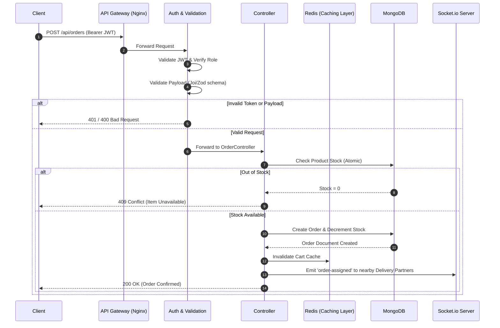

# RapidCloth - Backend Architecture & System Design Guide

## 1. Backend System Component Breakdown

RapidCloth’s backend uses a robust **Layered Architecture** (often referred to as an Onion or N-Tier Architecture). Built with **Node.js, Express.js, and MongoDB**, it separates concerns to ensure business logic is isolated from HTTP transport mechanisms, making the system highly testable and scalable.

### Architectural Layers

1. **Router Layer (`/routes`)**
   - **Role:** The traffic cop. It maps HTTP verbs (GET, POST) and endpoints to specific Controller methods. It acts as the first line of defense where Middlewares (Authentication, Rate Limiting, Validation) are applied.
2. **Controller Layer (`/controllers`)**
   - **Role:** Handles the HTTP Request and Response cycle. It extracts payload data (`req.body`, `req.params`), passes it to the Service/Model layer, and formats the final JSON response (including HTTP status codes like 200, 400, 404, 500).
3. **Service Layer (Business Logic) - *Recommended***
   - **Role:** Encapsulates the core business rules (e.g., calculating cart totals, matching delivery partners to zones, or calling external AI Recommendation APIs). *Tip: If business logic currently lives in controllers, abstracting it to a Service layer makes unit testing much easier.*
4. **Data Access / DAO Layer (`/models`)**
   - **Role:** Utilizes **Mongoose** schemas to define database structure, enforce schema constraints at the application level, and execute direct database queries. 
5. **Middleware Layer (`/middleware`)**
   - **Role:** Modular interceptors. Handles cross-cutting concerns like:
     - `auth.js`: Verifying JWTs and extracting user roles (`authenticate`, `superAdminOnly`).
     - `upload.js`: Managing multipart form data (images) via Multer/Cloudinary.
     - `validate.js`: Enforcing strict payload schemas before the controller is ever hit.

### Sequential Request Flow
`Client Request` ➔ `Express Router` ➔ `Middlewares (RateLimit, Auth, Joi/Zod)` ➔ `Controller` ➔ `Service/Mongoose Model` ➔ `MongoDB` ➔ `Controller formats JSON` ➔ `Client Response`

---

## 2. Complete API Specification (Key Endpoints)

Below is a high-level representation of RapidCloth's core domains. *(Note: This covers the most critical business operations.)*

| Domain | Method | Route | Request Body / Params | Auth Required | Description | Status Codes |
| :--- | :--- | :--- | :--- | :--- | :--- | :--- |
| **Auth** | `POST` | `/api/auth/register` | `{ email, password, name, role }` | None | Register a new user/seller/delivery | `201`, `400` |
| **Auth** | `POST` | `/api/auth/login` | `{ email, password }` | None | Authenticate and receive JWT | `200`, `401` |
| **Cart** | `POST` | `/api/cart/add` | `{ productId, quantity }` | User | Add an item to the shopping cart | `200`, `401` |
| **Orders** | `POST` | `/api/orders` | `{ deliveryAddress, paymentMethod }` | User | Checkout and place an order | `200`, `400`, `401` |
| **Delivery** | `PUT` | `/api/delivery/orders/:id/accept` | `Param: orderId` | Delivery | Partner accepts assigned order | `200`, `403`, `404` |
| **Delivery** | `PUT` | `/api/delivery/orders/:id/verify-otp`| `{ otp }` | Delivery | Complete delivery via OTP verification | `200`, `400`, `403` |
| **Seller** | `POST` | `/api/seller/dashboard/products` | `FormData` (Images + Details) | Seller/Admin | Upload a new catalog product | `200`, `403` |
| **SuperAdmin**| `POST` | `/api/superadmin/zones` | `{ name, coordinates }` | SuperAdmin | Create geographical operational zones | `201`, `403` |
| **AI/TryOn** | `POST` | `/api/try-on/generate` | `{ userImage, garmentId }` | Optional Auth | Generate virtual try-on composite | `200`, `500` |

---

## 3. Backend End-to-End Data Flow

The following Mermaid diagram visualizes the lifecycle of a secure, data-intensive request (e.g., placing an order) combined with asynchronous real-time events.



---

## 4. Database Interaction & Security

### A. Database Optimization & Caching Strategy
While MongoDB handles primary persistence, adding **Redis** provides massive performance boosts:
- **Product Catalog:** Frequently accessed routes (`GET /api/products`) should be cached in Redis. When a seller updates a product, the backend issues a cache invalidation for that specific product key.
- **Session & Rate Limiting:** Redis is ideal for tracking IP-based rate limiting (preventing DDoS attacks on endpoints like `/api/upload/signature`) and managing invalidated JWTs (token blacklists).
- **Geospatial Queries:** MongoDB's `2dsphere` indexes handle delivery partner proximity. However, tracking live driver locations is best kept strictly in-memory (Socket.io) or Redis, as writing GPS pings to MongoDB every 3 seconds will cause severe I/O bottlenecks.

### B. Middleware & Security Implementation
1. **Authentication (JWT):** 
   - Ensure the JWT secret is strong. Keep token lifespans short (e.g., 1 hour) and implement a Refresh Token rotation strategy.
2. **Rate Limiting:** 
   - Apply `express-rate-limit` globally (e.g., 100 requests / 15 mins), with stricter limits on auth and upload generation endpoints to prevent signature spamming.
3. **Input Sanitization:** 
   - Use `express-mongo-sanitize` to strip `$` and `.` characters from incoming request bodies, preventing NoSQL injection attacks.
   - Use `helmet` to automatically set secure HTTP headers (e.g., hiding the `X-Powered-By: Express` header).

---

## 5. Suggestions, Edge Cases & Pro Tips

### Edge Cases to Handle
1. **The "Double Checkout" Race Condition:**
   - *Scenario:* Two users try to purchase the last remaining stock of a shirt at the exact same millisecond. 
   - *Solution:* Use Mongoose Optimistic Concurrency Control (Version keys `__v`) or atomic `$inc` operations with query conditions:
     ```javascript
     const result = await Product.updateOne(
       { _id: productId, stock: { $gte: quantityRequested } },
       { $inc: { stock: -quantityRequested } }
     );
     // If result.modifiedCount === 0, throw a 409 Conflict (Out of stock)
     ```

2. **Delivery Partner Offline Abandonment:**
   - *Scenario:* A delivery partner accepts an order, picks it up, but their phone dies before delivering it. The order hangs in `picked-up` status indefinitely.
   - *Solution:* Implement a cron job (via Node `node-cron` or BullMQ). If an order is stuck in `picked-up` for > 3 hours, automatically escalate it by creating a Support Ticket and alerting a Zone Admin.

3. **Orphaned Image Uploads:**
   - *Scenario:* A seller generates an upload signature, uploads the image to Cloudinary, but drops connection before clicking "Save Product". The image is now floating on Cloudinary costing you storage, but not linked to any MongoDB product.
   - *Solution:* Use a Webhook strategy. Have Cloudinary ping your server when an image is successfully uploaded. Alternatively, run a weekly cleanup script that compares Cloudinary Asset IDs against your MongoDB `Product` image arrays and deletes orphans.

### Backend Pro Tips
- **Transactions:** For complex flows like "Create Order -> Deduct Wallet -> Reduce Stock", wrap them in a **MongoDB Session Transaction**. If the stock reduction fails, the wallet deduction rolls back automatically, preventing data inconsistencies.
- **Centralized Error Handling:** Instead of `try/catch` with `res.status(500)` in every single controller, create an asynchronous error wrapper (e.g., `express-async-handler`) and a global error-handling middleware. This keeps your controllers incredibly clean.
- **Logging:** Remove `console.log` in production. Integrate **Winston** or **Pino** to output structured JSON logs, and stream them to Datadog, AWS CloudWatch, or an ELK stack for easy debugging.
