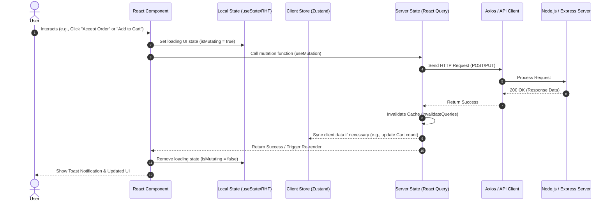

# RapidCloth - Comprehensive Frontend Architecture Guide

## 1. Component Architecture & Hierarchy

To ensure scalability across RapidCloth's ecosystem, we adopt a **Feature-Based Architecture** combined with **Atomic Design** principles for UI components. This structure isolates business logic into features, keeping the application decoupled and easy to maintain across all four frontend applications (`frontend`, `adminFrontend`, `superadminFrontend`, `partnerFrontend`).

### Folder Structure Organization (Standard across all Frontends)

```text
src/
├── assets/             # Static files (images, icons, global styles)
├── components/         # Shared, reusable UI components (Atomic Design)
│   ├── ui/             # Atoms/Molecules (Button, Input, Modal, Badge, Spinner)
│   └── layout/         # Organisms (Navbar, Sidebar, Footer, PageContainer)
├── features/           # Feature-based modules (Core business logic)
│   ├── auth/           # Authentication (Login, Register, OTP)
│   │   ├── components/ # Auth-specific components
│   │   ├── hooks/      # Auth-specific custom hooks
│   │   └── api/        # Auth API endpoints (React Query functions)
│   ├── products/       # Product catalog, AI Recommendations (Customer App)
│   ├── cart/           # Shopping cart & checkout (Customer App)
│   ├── map/            # Real-time tracking map (Partner/Customer App)
│   └── analytics/      # Charts & Reports (Admin/Superadmin Apps)
├── hooks/              # Global custom hooks (useWindowSize, useSocket)
├── pages/              # Route-level components (Composed of features & layouts)
├── routes/             # React Router configuration and guards
├── services/           # Global API clients (Axios instance, interceptors)
├── store/              # Global client state (Zustand/Redux store)
└── utils/              # Global utilities (formatters, validators, constants)
```

### Component Tree & Ecosystem Layout

#### 1. Customer Frontend (`/frontend`)
```text
App (Providers: Query, Store, Socket)
└── CustomerLayout
    ├── Navbar (Logo, SearchBar, CartBadge, UserMenu)
    ├── PageView
    │   ├── Home (HeroBanner, CategorySlider, AIFeaturedProducts)
    │   ├── ProductDetails (ImageGallery, Details, VirtualTryOnModal)
    │   └── Checkout (AddressForm, PaymentGateway, OrderSummary)
    └── Footer
```

#### 2. Delivery Partner Frontend (`/partnerFrontend`)
```text
App (Providers: Query, Store, Socket)
└── PartnerLayout
    ├── PartnerHeader (OnlineToggle, EarningsWidget)
    └── PageView
        ├── Dashboard (MapContainer, CurrentOrderCard, ActionButtons)
        └── History (DeliveryList, PayoutStatus)
```

#### 3. Admin & Superadmin Frontends (`/adminfrontend`, `/superadmin`)
```text
App (Providers: Query, Store)
└── DashboardLayout
    ├── SidebarNavigation (Roles, Zones, Analytics, Disputes)
    ├── Topbar (AdminProfile, Notifications)
    └── PageView
        ├── AnalyticsDashboard (RevenueCharts, UserStats, ZoneMetrics)
        ├── EntityManagement (DataGrid, EditModal, StatusToggle)
        └── Settings
```

---

## 2. Comprehensive Frontend Data Flow

The following diagram illustrates the unidirectional data flow cycle in RapidCloth, showcasing how user interactions travel from local state to global/server state and trigger UI re-renders.



---

## 3. State Management & Data Fetching Strategy

RapidCloth separates state into three distinct layers to prevent performance bottlenecks and maintain a clean architecture:

### A. Server State (React Query / SWR)
- **Role:** Managing asynchronous data from the backend (Products, Orders, Deliveries).
- **Strategy:** 
  - Handle caching, background fetching, and deduplication automatically.
  - Use **Optimistic Updates** for high-frequency actions (e.g., Liking a product, Partner toggling online status) to make the UI feel instant.
  - Rely on `queryClient.invalidateQueries` after mutations to trigger background refetches instead of manually updating global state arrays.

### B. Global Client State (Zustand / Redux Toolkit)
- **Role:** Managing synchronous, app-wide UI state.
- **Strategy:**
  - Store data like Theme preferences (Dark/Light), UI overlays (Sidebar open/close, Global Modals), and temporary multi-step data (e.g., Checkout wizard steps).
  - Use **Zustand** for a lightweight, boilerplate-free approach, or **Redux Toolkit** if complex state time-traveling is required.

### C. Local Component State (React `useState` / `useReducer`)
- **Role:** Isolated state for a single component.
- **Strategy:** Handle local UI toggles, accordion states, and internal component behavior without polluting the global store.

### Side Effects & Error Boundaries
- **Error Boundaries:** Wrap major page routes in React Error Boundaries to catch unhandled crashes gracefully, displaying a custom fallback UI (e.g., "Oops! Something went wrong.") rather than a blank screen.
- **Loading States:** Leverage React Query's `isLoading` flags to conditionally render premium **Skeleton Loaders** instead of basic spinners for a polished user experience.

---

## 4. Form Handling & Client-Side Validations

Forms are a critical touchpoint across all RapidCloth apps (Checkout, Seller Onboarding, Admin Data Entry).

- **Data Collection (React Hook Form):** Use uncontrolled components to maximize performance and eliminate unnecessary re-renders during typing.
- **Schema Validation (Zod):** Define strict, reusable validation schemas outside of components (e.g., validating proper geolocation formats, secure passwords, or valid Indian phone numbers).
- **Feedback Loop:**
  - Integrate Zod directly with React Hook Form using `@hookform/resolvers/zod`.
  - Errors map immediately to UI fields `onChange` or `onBlur`, providing real-time inline red-text feedback.
  - Upon successful validation, the validated payload is passed to the React Query mutation.

---

## 5. Suggestions, Edge Cases & Tips for Development

To ensure RapidCloth feels like a premium, enterprise-grade application, consider these strategies:

### A. Edge Cases to Handle
1. **Network Disconnections (Partner App):** Delivery partners may enter areas with poor connectivity. Implement `offline` event listeners. Use React Query's offline mutation queue or local storage to save status updates and sync them when the connection is restored.
2. **Race Conditions in Cart (Customer App):** Two users might try to buy the last item. Handle backend 409 Conflict or 400 Bad Request gracefully in the frontend by alerting the user and automatically refetching the cart/product stock.
3. **Socket Reconnection Storms:** If the server restarts, thousands of sockets might reconnect instantly. Implement randomized exponential backoff in your Socket.io client configuration to prevent overwhelming the server.
4. **Token Expiration:** Implement Axios interceptors. If a request returns a `401 Unauthorized`, gracefully intercept it, call a `/refresh-token` endpoint (if implemented) in the background, and retry the failed request without logging the user out abruptly.

### B. Pro Tips for UI/UX
- **Micro-Animations:** Use `Framer Motion` to add subtle exit/enter animations for modals, cart sidebars, and page transitions. It heavily impacts the perceived quality of the app.
- **Image Optimization:** For the Customer App, always use responsive images (`srcset`) and lazy loading (`loading="lazy"`) for the product catalog to ensure high Lighthouse performance scores.
- **Debouncing Inputs:** In the Superadmin/Admin apps, wrap search bars and filters with a `useDebounce` hook to prevent spamming the backend API on every keystroke.
- **Virtualization:** In the Superadmin portal or Delivery history, if lists grow beyond 100+ items, implement `react-window` or `react-virtuoso` to render only the visible items in the DOM, keeping scrolling smooth at 60FPS.
